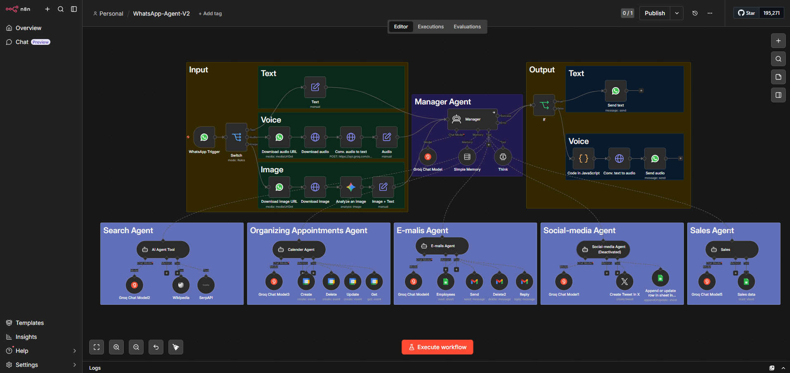

# WhatsApp Multi-Agent Automation System

A multi-agent AI system built in **n8n** that receives WhatsApp messages (text, voice, or image) and routes them through a Manager Agent to specialized sub-agents that handle search, calendar management, email, social media, and sales tasks — all without human intervention.

## Overview

Most WhatsApp bots handle a single task. This project explores a different pattern: a **Manager Agent** that interprets incoming messages and delegates work to the right specialist agent, similar to how a human assistant would triage requests before handing them off to the right team member.

## Architecture

**Flow:**
1. **Input Layer** — A WhatsApp trigger receives the message and routes it by type (text, voice, or image).
2. **Pre-processing** — Voice messages are downloaded and transcribed to text; images are downloaded and analyzed before being converted into a usable text prompt.
3. **Manager Agent** — A central LLM-powered router (using a Groq-hosted chat model + short-term memory) decides which sub-agent should handle the request.
4. **Sub-Agents** — Each is a self-contained agent with its own model, memory, and toolset:
   - **Search Agent** — Wikipedia + SerpAPI for general knowledge and web lookups
   - **Organizing Appointments Agent** — Google Calendar (create, update, delete, get events)
   - **E-mails Agent** — Gmail (read, send, delete, reply)
   - **Social-media Agent** — X/Twitter and Google Sheets integration *(currently deactivated — in progress)*
   - **Sales Agent** — Google Sheets read/write for sales data
5. **Output Layer** — The response is converted back into the appropriate format (text or synthesized voice) and sent back to the user over WhatsApp.

## Tech Stack

- **Orchestration:** n8n
- **LLMs:** Groq-hosted chat models (per-agent instances)
- **Messaging:** WhatsApp Business API
- **Integrations:** Google Calendar, Gmail, Google Sheets, X (Twitter) API, SerpAPI, Wikipedia API
- **Logic:** JavaScript (Code nodes) for custom transformations

## Current Status

This is an active, evolving project — being transparent about where it stands:

| Component | Status |
|---|---|
| Input handling (text/voice/image) | ✅ Working |
| Manager Agent routing | ✅ Working |
| Search Agent | ✅ Working |
| Calendar Agent | ✅ Working |
| Email Agent | ✅ Working |
| Sales Agent | ✅ Working |
| Social-media Agent | 🚧 In progress (deactivated) |
| Automated test coverage | 🚧 Planned |
| Structured error handling / fallback logic | 🚧 Planned |

## Known Limitations

- No automated retry/fallback logic yet if a sub-agent call fails.
- Test coverage is minimal; evaluations are being added incrementally.
- Social-media Agent is not yet production-ready.

## Setup

1. Import `workflow.json` into your n8n instance.
2. Configure credentials for: WhatsApp Business API, Groq, Google Calendar, Gmail, Google Sheets, X API, SerpAPI.
3. Copy `.env.example` to `.env` and fill in your own values (see file for required variables).
4. Activate the workflow and point your WhatsApp Business webhook to the n8n trigger URL.

## Why This Project

Built to explore how far no-code/low-code tools like n8n can go in building genuinely agentic systems — not just linear automations, but a system that routes, reasons, and delegates across multiple specialized agents.
